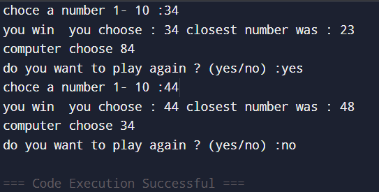

# A STUPID GAME

## How to Play
1. Enter a number between 1 and 10.  
2. The computer will pick a number too.  
3. The closest number to the target wins!  
4. Repeat if you want to play again.

##
 </a> 

